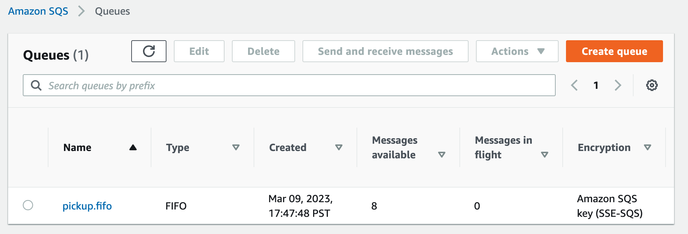
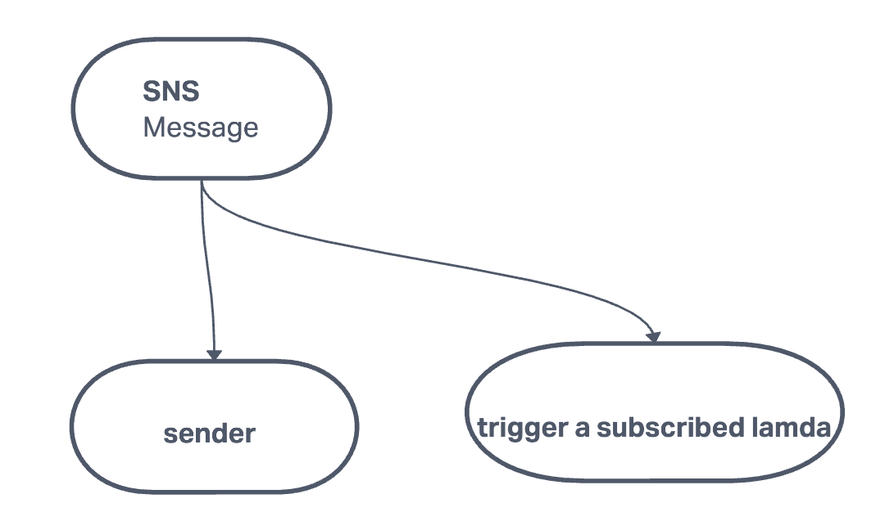

# caps-cloud

Author: Ashwini Uppal

## problem statement

Using only AWS Services: SQS, SNS, and client applications, create a cloud version of the CAPS system.

## Feature Tasks and Requirements

SNS Topic (FIFO): pickup which will receive all pickup requests from vendors.

SQS Queue (FIFO): packages which will contain all delivery requests from vendors, in order of receipt.

Subscribe this queue to the pickup topic so all pickups are ordered.

SQS Queue (Standard) for each vendor (named for the vendor) which will contain all delivery notifications from the drivers.

## Implementation Notes

The system should be able to handle multiple vendors and drivers. The system should be able to handle multiple deliveries for each vendor. 

Vendors will post “pickup” messages containing delivery information into the SNS pickup topic.

Pickup requests should be moved into a SQS FIFO Queue called packages for the drivers automatically.

Vendors should separately subscribe to their personal SQS Standard Queue and periodically poll the queue to see delivery notifications.

Drivers will poll the SQS packages queue and retrieve the delivery orders (messages) in order.

